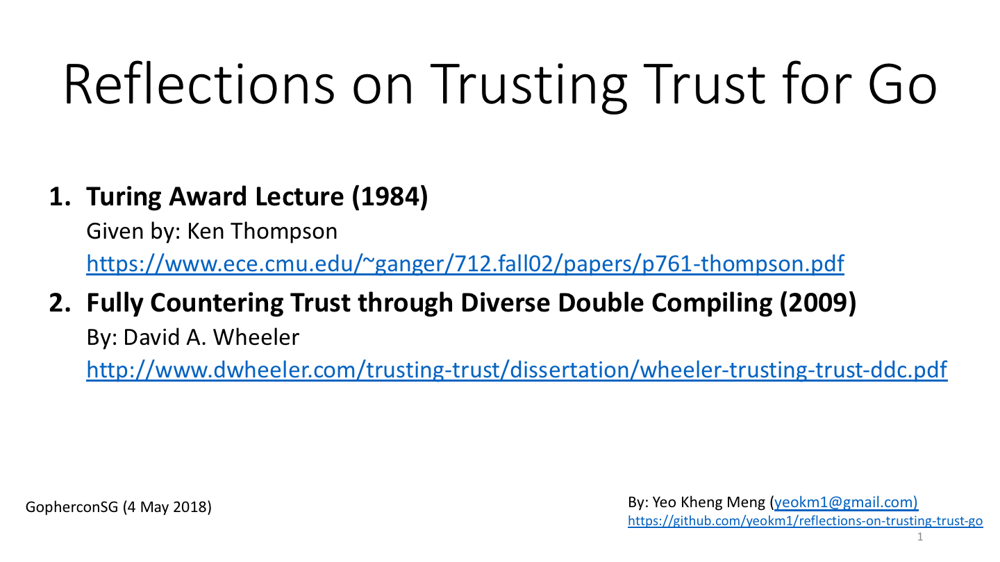

# reflections-on-trusting-trust-go
A talk about the Turing award lecture "Reflections on Trusting Trust" originally given by Ken Thompson. This talk was given in [Gophercon Singapore 2018](https://2018.gophercon.sg)

Demo Go programs are in the codes directory. My slides are available on slideshare in the picture link below.

[](https://www.slideshare.net/yeokm1/reflections-on-trusting-trust-for-go)

There are some SHA-256 checksum values used in my presentation. These values are dependent on the binaries generated by a specific compiler version which may change over time. The following shows the compiler version running on my macOS Sierra.

```bash
$ go version
go version go1.10.1 darwin/amd64
```

References
====
1. [Reflections on Trusting Trust paper source](https://www.ece.cmu.edu/~ganger/712.fall02/papers/p761-thompson.pdf)
2. [Fully Countering Trust through Diverse Double Compiling paper source](http://www.dwheeler.com/trusting-trust/dissertation/wheeler-trusting-trust-ddc.pdf)
3. I gave a C version of this talk before. You can see the code and slides [here](https://github.com/yeokm1/reflections-on-trusting-trust).
